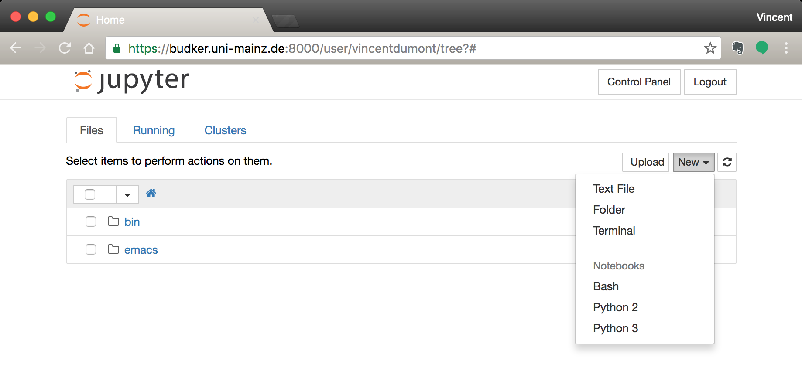
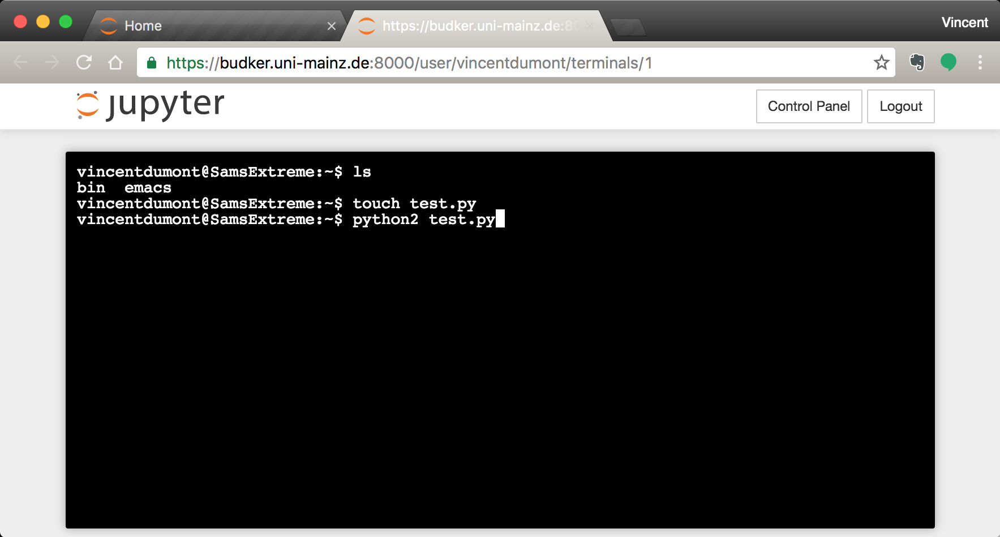

Multi-user Server
=================

A GNOME JupyterHub, or multi-user server has been created to allow each member to access the entire available dataset. Member who do not have access to the server but wish to access it should send a request to Dr. Sam Afach. Member who are not part of the GNOME collaboration will not be granted access to the dataset but are free to use our software on their own data.

The server can be accessed in two ways, either by acceding the `server's webpage <https://budker.uni-mainz.de:8000/hub/login>`_, or from your terminal through SSH::

  ssh -X username@budker.uni-mainz.de -p 8022

While SSH is very handy for people using UNIX-like operating systems, this can become more complicated for those working on Windows machines. Fortunately, access to a terminal is also possible through the webpage, which means directly from your internet browser! This can be done by clicking on the New tab after login and select Terminal:

You can then use the terminal window to access files and create new Python scripts for your analysis.

